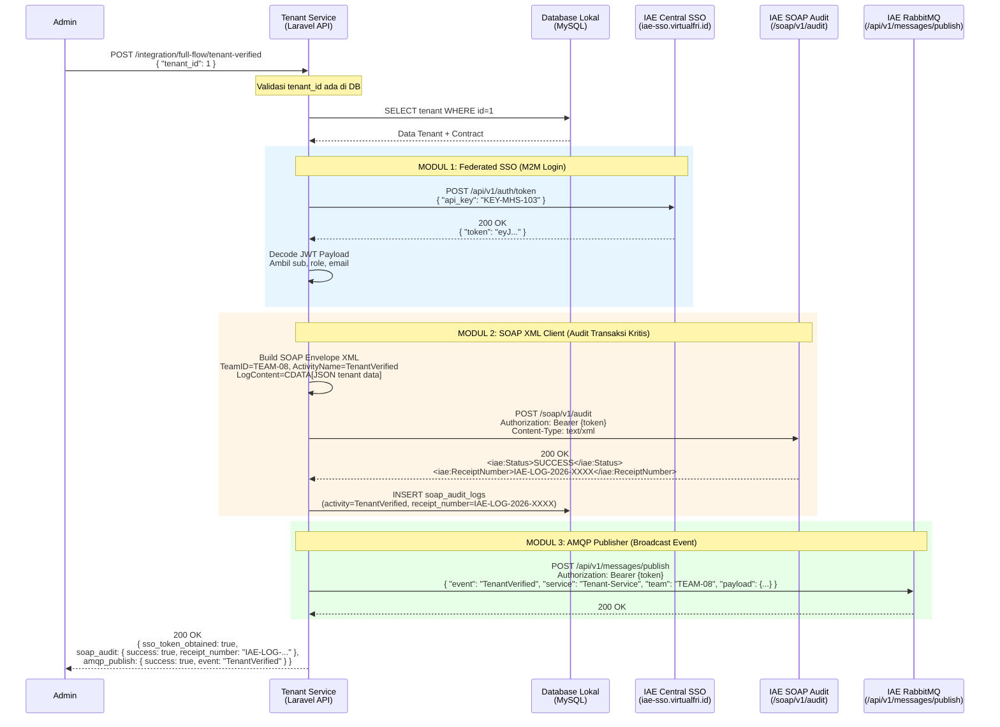

# Analisis Tugas 3 — Integrasi Layanan Manajemen Tenant dengan IAE Central

**Nama:** Vico Ricky Wijaya  
**NIM:** 102022400017  
**Kelompok:** 8  
**Service:** Manajemen Tenant (Tenant Management Service)

---

## 1. Justifikasi Transaksi Kritis

### Transaksi yang Dipilih: **TenantVerified** (Verifikasi Penyewa oleh Admin)

Transaksi **verifikasi tenant** dipilih sebagai transaksi paling kritis dalam layanan Manajemen Tenant karena memenuhi seluruh kriteria transaksi kritis berikut:

#### Mengapa Ini Transaksi Kritis?

| Kriteria | Penjelasan |
|----------|------------|
| **State-Changing** | Mengubah status tenant secara permanen dari `pending` → `verified` atau `rejected`. Perubahan ini langsung mempengaruhi hak akses dan status hukum penyewa dalam ekosistem Digital City. |
| **Multi-entitas** | Satu aksi verifikasi memperbarui 2 entitas sekaligus: `tenants` (status + verified_at) dan `contracts` (status dari `draft` → `approved`, dengan timestamp `approved_at`). |
| **Irreversible (sulit dibatalkan)** | Setelah tenant diverifikasi, kontrak sudah berlaku. Pembatalan memerlukan proses terpisah dan berdampak hukum/finansial. |
| **Compliance & Audit Trail** | Setiap verifikasi harus tercatat permanen untuk keperluan: audit internal, penyelesaian sengketa, dan kepatuhan regulasi properti/sewa. |
| **Business Critical** | Tanpa verifikasi, tenant tidak dapat menggunakan layanan Digital City. Ini adalah "gate" utama dalam alur bisnis. |

#### Mengapa Menggunakan SOAP?
SOAP digunakan untuk transaksi ini karena:
- Server IAE Central menggunakan protokol SOAP/XML untuk audit log
- SOAP menjamin delivery dan menyediakan `ReceiptNumber` sebagai bukti penerimaan yang valid secara formal
- Format XML lebih rigid dan cocok untuk dokumen audit yang membutuhkan standar baku

#### Mengapa Menggunakan RabbitMQ?
RabbitMQ digunakan untuk menyebarkan event `TenantVerified` karena:
- Departemen lain (billing, akses kontrol, notifikasi) perlu mengetahui verifikasi ini secara asinkron
- Message broker memastikan pesan tersampaikan meski departemen penerima sedang down sementara
- Decoupling: Tenant Service tidak perlu tahu siapa yang butuh informasi verifikasi ini

---

## 2. Sequence Diagram Internal

Diagram berikut menggambarkan aliran interaksi layanan **Tenant Service** dengan sistem terpusat IAE Central saat terjadi verifikasi tenant:



---

## 3. Deskripsi Teknis Implementasi

### Modul 1: Federated SSO
- **File:** `app/Services/SsoService.php`
- **Endpoint dipanggil:** `POST https://iae-sso.virtualfri.id/api/v1/auth/token`
- **Mode:** M2M menggunakan `api_key: KEY-MHS-103`
- **Hasil:** JWT Bearer Token yang digunakan untuk modul SOAP dan AMQP
- **Mapping Lokal:** Payload JWT di-decode dan disimpan ke tabel `sso_users` dengan mapping role:
  - IAE role `admin` → lokal `admin`
  - IAE role `warga` → lokal `warga`
  - IAE role `tenant` → lokal `tenant`

### Modul 2: SOAP XML Client
- **File:** `app/Services/SoapAuditService.php`
- **Endpoint dipanggil:** `POST https://iae-sso.virtualfri.id/soap/v1/audit`
- **Format XML:**
```xml
<?xml version="1.0" encoding="UTF-8"?>
<soap:Envelope xmlns:soap="http://schemas.xmlsoap.org/soap/envelope/" xmlns:iae="http://iae.central/audit">
    <soap:Body>
        <iae:AuditRequest>
            <iae:TeamID>TEAM-08</iae:TeamID>
            <iae:ActivityName>TenantVerified</iae:ActivityName>
            <iae:LogContent><![CDATA[{"tenant_id":1,"tenant_name":"...","status":"verified"}]]></iae:LogContent>
        </iae:AuditRequest>
    </soap:Body>
</soap:Envelope>
```
- **Penyimpanan:** `ReceiptNumber` dari response disimpan ke tabel `soap_audit_logs`

### Modul 3: AMQP Publisher
- **File:** `app/Services/AmqpPublisherService.php`
- **Endpoint dipanggil:** `POST https://iae-sso.virtualfri.id/api/v1/messages/publish`
- **Format JSON yang dikirim:**
```json
{
  "event": "TenantVerified",
  "service": "Tenant-Service",
  "team": "TEAM-08",
  "timestamp": "2026-01-01T00:00:00+07:00",
  "payload": {
    "tenant_id": 1,
    "name": "Nama Tenant",
    "email": "tenant@email.com",
    "status": "verified",
    "contract_number": "DRAFT-XXXX-1",
    "action": "tenant_verified",
    "description": "Penyewa telah diverifikasi oleh admin dan kontrak telah disetujui."
  }
}
```

---

## 4. Endpoint Integrasi yang Tersedia

| Method | Endpoint | Fungsi |
|--------|----------|--------|
| `POST` | `/api/v1/integration/sso/login` | Login warga ke SSO, simpan ke sso_users |
| `POST` | `/api/v1/integration/sso/m2m` | Login M2M service-to-service |
| `POST` | `/api/v1/integration/soap/audit` | Kirim SOAP audit manual |
| `GET`  | `/api/v1/integration/soap/logs` | Lihat riwayat SOAP audit log |
| `POST` | `/api/v1/integration/amqp/publish` | Publish event ke RabbitMQ manual |
| `POST` | `/api/v1/integration/full-flow/tenant-verified` | **Orkestrasi penuh**: SSO → SOAP → AMQP |
